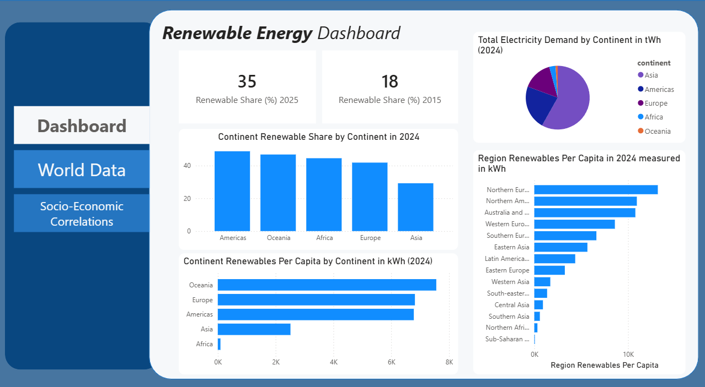
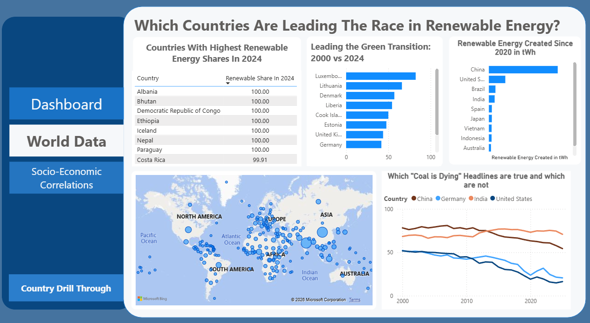
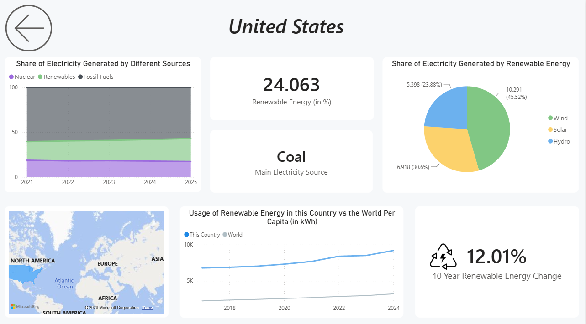
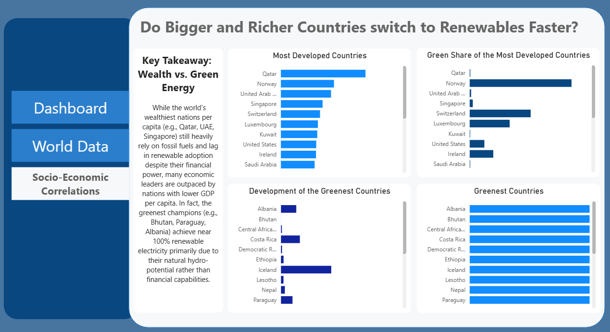

# 🌍 Global Renewable Energy & Socio-Economic Analytics Dashboard

A comprehensive, executive-ready Power BI analytics solution that explores global renewable energy adoption, regional consumption patterns, and the socio-economic factors driving the green transition (2000–2025).

This project showcases an end-to-end data analytics workflow: from **data enrichment and relational modeling** to **advanced DAX metrics and custom UI/UX design** (Light Mode with an application-style navigation sidebar).

---

## 📊 Dashboard Overview & Core Features

### 1. Executive Landing & Regional Breakdown
*Provides high-level global KPIs alongside continental and sub-regional breakdowns (Renewable Share vs. Per Capita Consumption).*

### 2. World Data Overview
*Interactive global mapping, historical trend lines, and tracking of major energy transition shifts.*

### 3. Country Deep-Dive (Drill-Through: USA Example)
*Context-aware drill-through page featuring dynamic KPI cards, source breakdown (preventing double-counting), and world benchmarks.*

### 4. Socio-Economic Correlation Analysis
*A 4-quadrant analytical matrix evaluating the relationship between economic status (GDP per Capita) and green energy adoption.*

---

## 🛠️ Data Architecture & Tech Stack

*   **Database & Data Enrichment:** Combined two separate data sources to build a robust data pipeline:
    1. **Primary Dataset:** Kaggle Global Renewable Energy & Electricity Statistics.
    2. **Geographical Mapping Dataset:** ISO-3166 Country Codes & Regional Classification (used to enrich the model with Continents and Sub-Regions).
*   **Data Modeling:** Implemented a clean **Star Schema** in Power BI, connecting normalized Dimension tables (`Date`, `Country`, `Geography`) to Fact tables with strict 1-to-many relationships.
*   **Advanced DAX Analytics:** 
    * Created **weighted percentage measures** (accounting for population and total demand) to prevent mathematically incorrect averaging of percentage columns across regions.
    * Developed custom time-intelligence metrics (e.g., 10-Year Renewable Energy Change).
*   **UI/UX Design:** Built an intuitive, web-app style interface featuring a consistent vertical sidebar navigation, custom tooltips, cross-report drill-throughs, and structured card layouts.

---

## 💡 Key Analytical Insights

1. **The Regional Paradox (Share vs. Per Capita):** While regions like **Africa** display a high relative renewable share (~46%) due to hydro-heavy grids, their per capita consumption remains extremely low (~62 kWh/person). Conversely, **Europe** and **The Americas** consume significantly more green energy per capita (~4,200–4,900 kWh/person), highlighting stark global gaps in energy infrastructure.
2. **Wealth vs. Green Energy Misconception:** The data disproves the assumption that the richest nations lead the green transition. The greenest nations (e.g., Bhutan, Paraguay, Albania) achieve near 100% renewable electricity due to natural hydro-potential rather than GDP, whereas wealthy nations per capita (e.g., Qatar, UAE, Singapore) still heavily rely on fossil fuels.

---

## 🚀 Key Skills & Power BI Features Demonstrated
*   **Data Blending & Transformation:** Combining and cleaning multi-source datasets via SQL / Power Query.
*   **Cross-Report Drill-Through:** Dynamic filtering from high-level global charts down to granular country profiles.
*   **Custom Tooltips & Navigation:** Report page tooltips for on-hover insights and smooth bookmark/page navigation.
